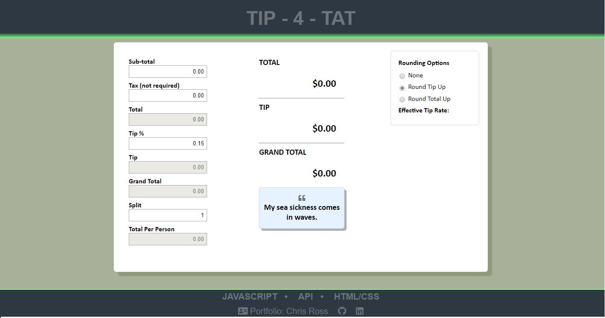

<h1>Tip Calculator</h1>

Visit online:
https://vtchris.github.io/tipCalculator/

<h3>Technology</h3>

<ul>
  <li>JavaScript</li>
  <li>HTML/CSS</li> 
</ul>

Font Awesome was used for the purposes of adding icons.

Joke API courtesy of: Max Berkelmans / LemmoTresto https://rapidapi.com/LemmoTresto/api/joke3

The goal of tis coding challenge was to build a tip calculator using vanilla javaScript based on the criteria below. In addition to these requirements, I wanted a calculator that could round up the tip or the grand total to the nearest dollar. I also decided to save the rounding preferences and tip % to localStorage so the preferred settings would be saved. Last, I wanted to include a joke using an API as I thought this could be a fun way to end an evening out! Thank you for checking out my tip calculator!

The requirements for this application include the following:

<ul>
  <li>Take in the value of the bill</li>
  <li>Take in the desired tip percentage</li>
  <li>Include the option to split the bill/tip by the people at the table</li>
  <li>The application should then calculate the amount of tip per table (or per person if the split option is chosen) and return the value to the user.</li>
  <li>Code should be clean and readable. Don't neglect the comments!</li>
  <li>You must push your code in a git repository and submit git repository URL to the challenge email.</li>
  <li>Commit early, commit often; we will look at the progression of your code throughout application development. Consider your commits valuable. </li>
  <li>You shouldn't need any external libraries to complete this application... BUT if you do, you need to document it in your readme and let us know why it was a better choice.</li>
  <li>The bill value must be a positive float but your application must handle user input that might be a negative or 0 dollar amount (i.e. error handling).</li>
  <li>The user input percentage for the tip must be a positive float.</li>
  <li>The returned value must be a float rounded to two decimal points (i.e. accurate dollars and cents).</li>
</ul>
